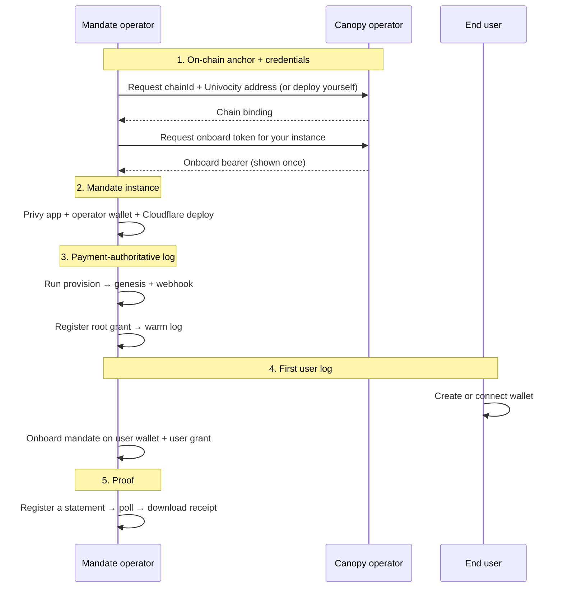
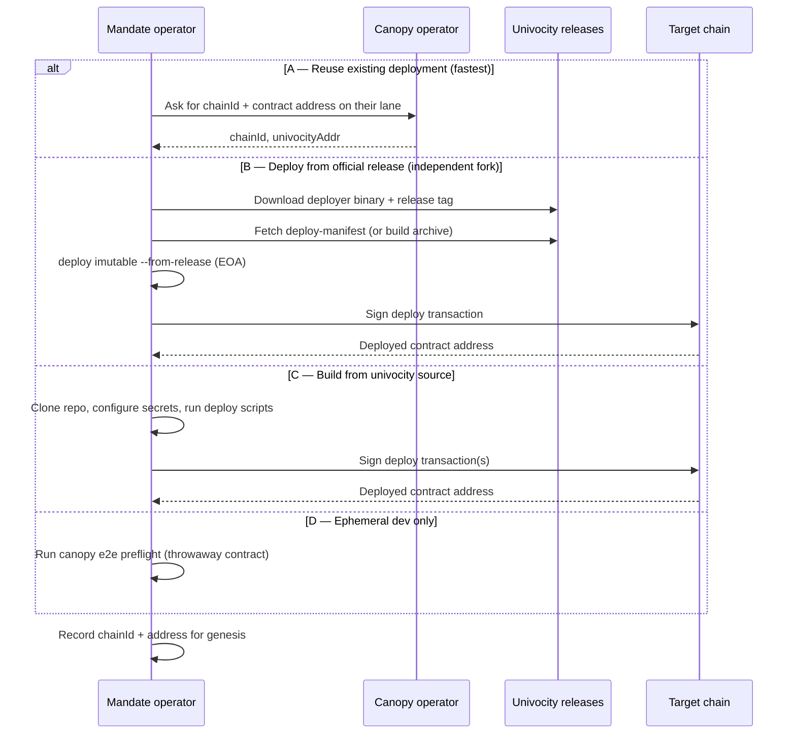
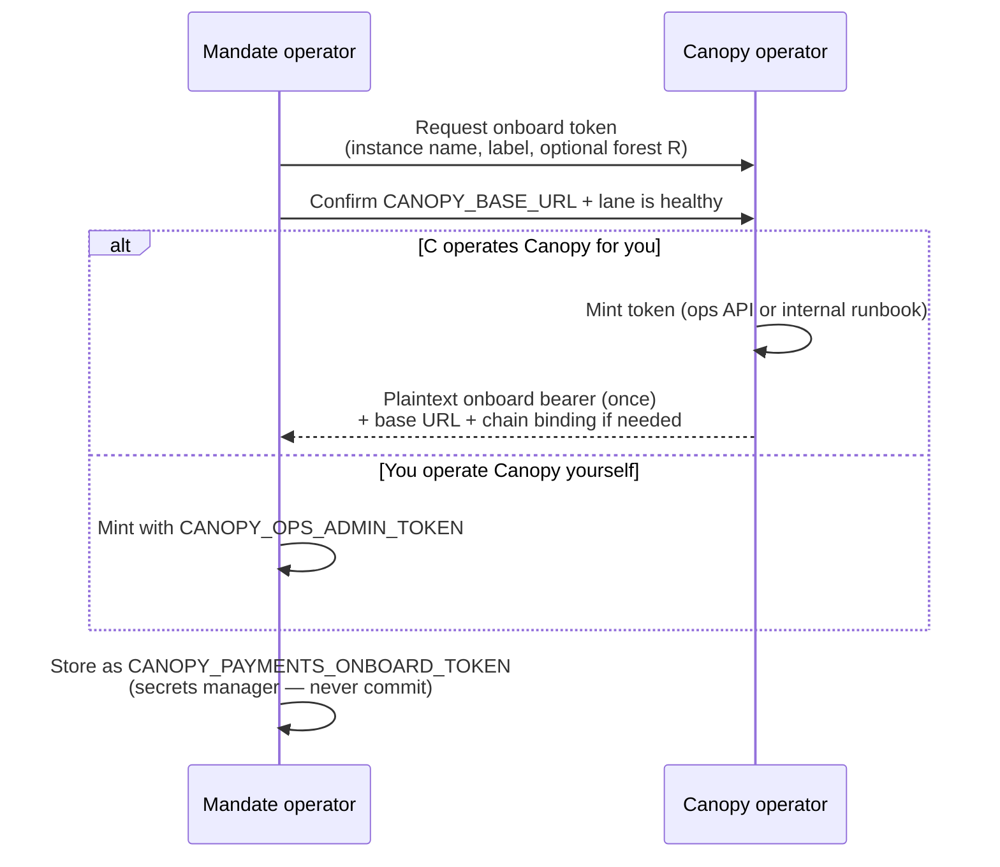
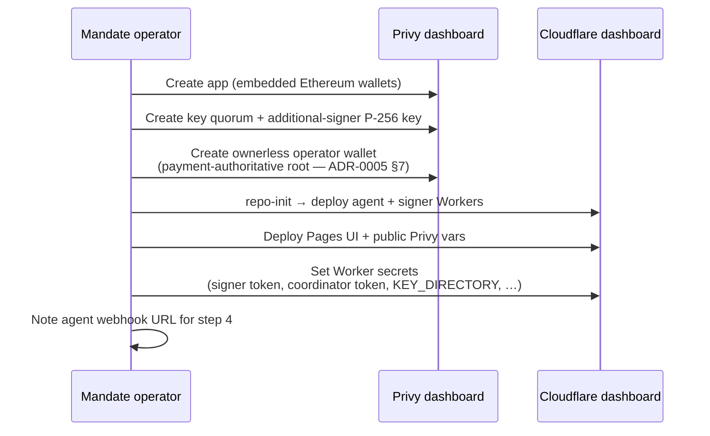
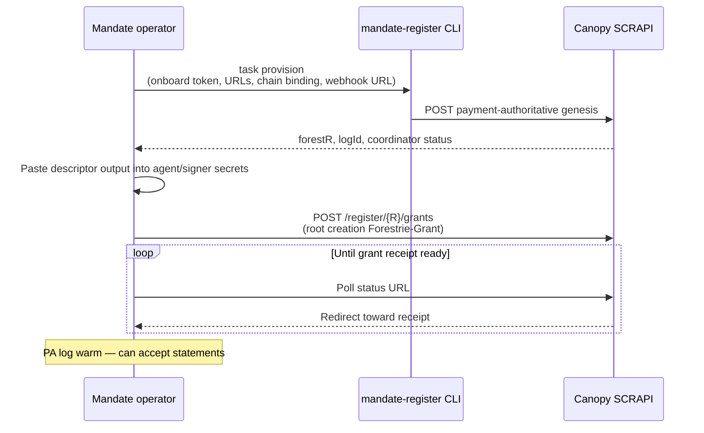
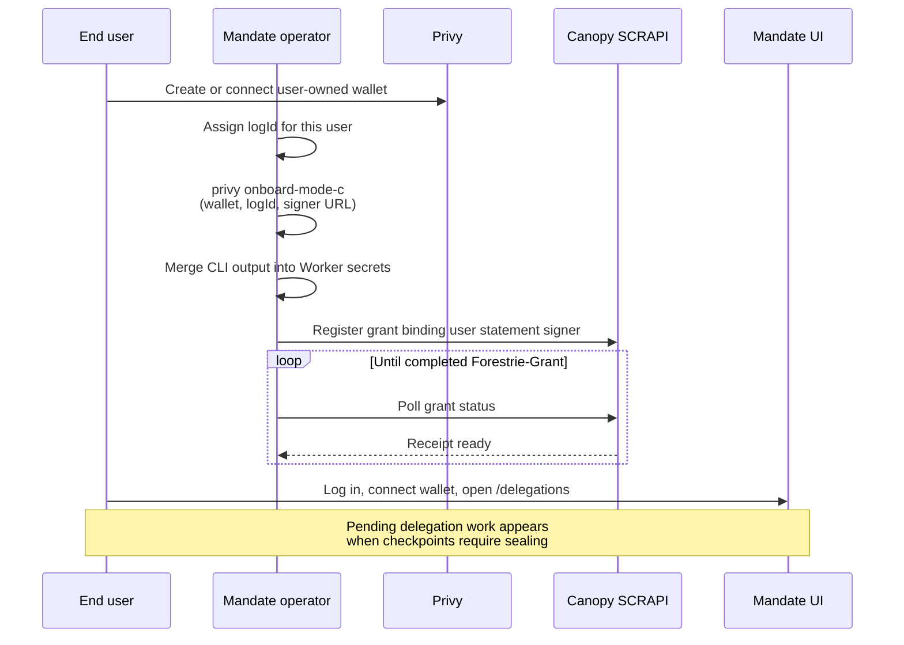
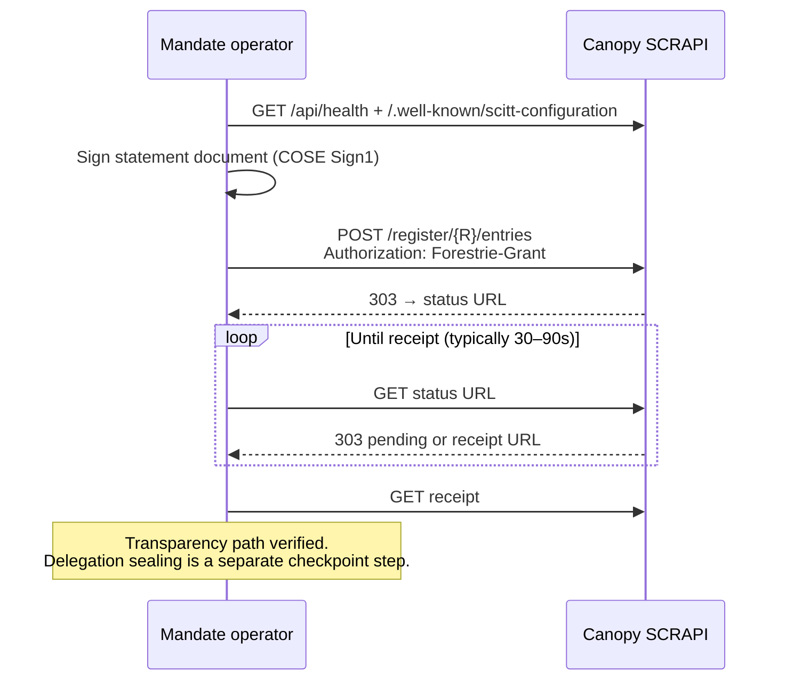
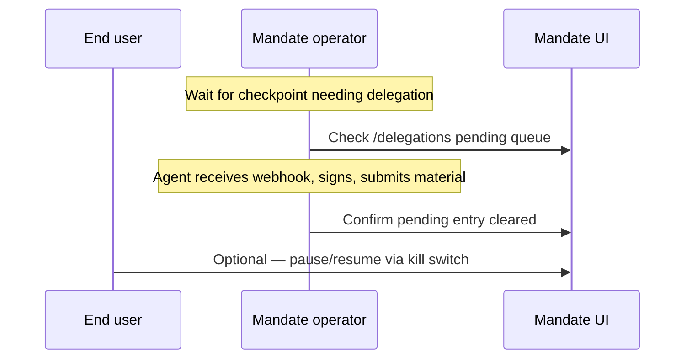

# Forking and running an independent Mandate

**Status:** DRAFT  
**Date:** 2026-06-23  
**Related:** [README.md](README.md), [ADR-0005 BYOK modes](docs/adr/adr-0005-byok-delegation-modes.md),
[ARC-021 payment onboarding](../devdocs/arc/arc-021-payment-onboarding/README.md),
[canopy SCITT hackathon demo](../canopy/docs/demo/scitt-hackathon.md)

Minimal runbook for operating a **forked mandate instance** against a Canopy
SCRAPI stack. Future demos (for example a SCITT hackathon with BYOK sealing)
will point here for **bootstrap**; participant statement flows stay in
[scitt-hackathon.md](../canopy/docs/demo/scitt-hackathon.md).

Diagrams below show **who does what** — operator actions, user actions, and
hand-offs between parties. They omit internal worker/DO behaviour.

---

## Bootstrap overview



Mandate is the **operator console and sealing plane** for BYOK user logs. Canopy
is the **transparency pipe**. You need both, plus an onboard token from whoever
runs the Canopy ops plane.

---

## Prerequisites

| Item | Notes |
| ---- | ----- |
| Git fork of `forestrie/mandate` | `pnpm install` (see [ADR-0004](docs/adr/adr-0004-delegation-cose-distribution.md) for GitHub Packages auth) |
| Cloudflare account | Pages (`@mandate/ui`) + Workers (agent, signer) |
| Privy app | Dashboard app id + secret; embedded Ethereum wallets enabled |
| Canopy SCRAPI base URL | e.g. `https://api-a.forest-2.forestrie.dev` or your self-hosted worker |
| Delegation-coordinator URL | e.g. `https://delegation-coordinator.a.forest-2.forestrie.dev` |
| Chain + Univocity address | 20-byte contract address bound at genesis |
| Onboard bearer token | From Canopy operator (below) — gates **payment-authoritative** genesis |

Optional for local dev: [Doppler](https://www.doppler.com/) project `mandate-forestrie`
config `dev`, or copy `.dev.vars.example` files under `packages/apps/*`.

---

## 1 — Deploy Univocity (on-chain anchor)

Genesis binds your forest to a **chain id** and **contract address**. Choose one
path:



| Path | When to use |
| ---- | ----------- |
| **A** | Fork on a shared Forestrie dev lane |
| **B** | Independent fork; prebuilt deployer + release tag — no Foundry — see [releases](https://github.com/forestrie/univocity/releases) |
| **C** | Custom contract changes |
| **D** | Local smoke only — not production |

**B (detail):** download `deployer-darwin-arm64` or `deployer-linux-x64` from
[univocity-tools releases](https://github.com/forestrie/univocity-tools/releases),
verify the `.sha256` sidecar, then run one-shot EOA deploy:

```shell
./deployer-darwin-arm64 deploy imutable \
  --from-release v0.4.0 \
  --bootstrap-alg ks256 \
  --bootstrap-ks256-signer 0xYourBootstrapSigner \
  --deploy-key "$DEPLOY_KEY" \
  --rpc-url "$RPC_URL"
```

The command fetches `deploy-manifest-<tag>.json` from the
[Univocity release](https://github.com/forestrie/univocity/releases) when present
(preferred), otherwise the `univocity-<tag>.tar.gz` build archive. Foundry is
not required on the operator machine.

For Safe multisig deploys, use `deploy propose imutable` / `deploy approve` with
`--release-root` or `--from-manifest` instead; see
[univocity-tools CLI docs](https://github.com/forestrie/univocity-tools/blob/main/docs/agents/cli.md).

---

## 2 — Request an onboard token (Canopy operator)

Payment-authoritative genesis requires a **minted onboard bearer** from the Canopy
ops plane — not a mandate secret you invent yourself.



**You provide:** mandate hostname / instance name, token label (e.g.
`acme-mandate-prod`), optional planned forest UUID `R`.

**You receive:** onboard bearer (single disclosure), `CANOPY_BASE_URL`, and
`chainId` + `univocityAddr` if not already settled in step 1.

Mint reference ([ARC-021.1](../devdocs/arc/arc-021-payment-onboarding/01-ops-admin-token.md)):

```bash
curl -sS -X POST "$CANOPY_BASE_URL/api/payments/onboard-tokens" \
  -H "Authorization: Bearer $CANOPY_OPS_ADMIN_TOKEN" \
  -H "Content-Type: application/cbor" \
  --data-binary @<(node -e "const {encode}=require('cbor-x');process.stdout.write(encode(new Map([[1,'your-label']])))")
```

---

## 3 — Deploy mandate Workers and UI

Human setup in Privy and Cloudflare before any forest registration.



Full secret catalog: [service-secrets.md](docs/service-secrets.md). Deploy
detail: [README.md](README.md).

---

## 4 — Register the operator payment-authoritative log

Creates forest root **`R`**, binds Univocity, and registers your agent webhook
with the delegation-coordinator.



### CLI example

**Production:** use the **ownerless app-controlled** operator wallet from step 3
as genesis `bootstrapKey`. The default **Mode C** provision path is a dev/CI
shortcut (user-owned wallet); see [ADR-0005 §7](docs/adr/adr-0005-byok-delegation-modes.md).

```bash
doppler run --project mandate-forestrie --config dev -- \
  task provision \
  --onboard-token "$CANOPY_PAYMENTS_ONBOARD_TOKEN" \
  --canopy-url "$CANOPY_API_URL" \
  --coordinator-url "$DELEGATION_COORDINATOR_URL" \
  --webhook-url "$MANDATE_AGENT_WEBHOOK_URL" \
  --univocity-addr "$CANOPY_UNIVOCITY_ADDR" \
  --chain-id "$CANOPY_CHAIN_ID"
```

| Output field | Keep |
| ------------ | ---- |
| `forestR` | Bootstrap UUID `R` for SCRAPI paths |
| `logIdHex32` | Coordinator / grant log id |
| `descriptors` | `KEY_DIRECTORY` + `OPERATOR_ROOT_KEYS` for Workers |
| `genesis.coordinator` | Expect `publicRoot: ok`, `webhook: ok` |

Warm-log grant flow matches
[scitt-hackathon Appendix B](../canopy/docs/demo/scitt-hackathon.md#appendix-b--organizer-setup-not-the-main-show).

---

## 5 — Register the first user log

Each user log has its own `logId` and root key `K(L)`. Mode C (hosted sealing)
is the typical mandate fork path.



```bash
doppler run --project mandate-forestrie --config dev -- \
  task privy:onboard:mode-c -- \
  --log-id "<user-log-hex32>" \
  --wallet-id "<privy-wallet-id>" \
  --signer-url "$MANDATE_SIGNER_URL"
```

**Mode B (true BYOK):** user runs their own signer; you point
`OPERATOR_ROOT_KEYS` at their URL — see `mandate-register provision --mode B`.

**Separate regular forest per customer:** endorse on `R` with `GF_DERIVED`, then
genesis `R'` ([ARC-021.3](../devdocs/arc/arc-021-payment-onboarding/03-phase-b-regular-forest.md)).
Many forks issue **child grants under the same `R`** instead.

---

## 6 — Prove the setup: register a statement (SCRAPI)

Confirms Canopy accepts grants and produces receipts. Same participant shape as
[scitt-hackathon Part 1](../canopy/docs/demo/scitt-hackathon.md#part-1--participant-flow).



### Commands

```bash
export CANOPY_BASE_URL="https://api.example.com"
export BOOTSTRAP_LOG_ID="<forestR from step 4>"
export COMPLETED_GRANT_B64="<base64 Forestrie-Grant>"

curl -sS "$CANOPY_BASE_URL/api/health" | jq .
curl -sS "$CANOPY_BASE_URL/.well-known/scitt-configuration" | jq .

curl -sS -D headers.txt -o /dev/null -X POST \
  "$CANOPY_BASE_URL/register/$BOOTSTRAP_LOG_ID/entries" \
  -H "Authorization: Forestrie-Grant $COMPLETED_GRANT_B64" \
  -H 'Content-Type: application/cose; cose-type="cose-sign1"' \
  --data-binary @statement.cose
```

Poll for receipt (expect **303** chain ending in `/receipt`):

```bash
STATUS_URL="$(grep -i '^location:' headers.txt | cut -d' ' -f2- | tr -d '\r')"
case "$STATUS_URL" in http*) ;; *) STATUS_URL="$CANOPY_BASE_URL$STATUS_URL" ;; esac

while true; do
  curl -sS -D poll-headers.txt -o /dev/null "$STATUS_URL"
  LOC="$(grep -i '^location:' poll-headers.txt | cut -d' ' -f2- | tr -d '\r')"
  echo "$(date -u +%H:%M:%S) → $LOC"
  case "$LOC" in */receipt) RECEIPT_URL="$LOC"; break ;; esac
  sleep 2
done

case "$RECEIPT_URL" in http*) ;; *) RECEIPT_URL="$CANOPY_BASE_URL$RECEIPT_URL" ;; esac
curl -sS "$RECEIPT_URL" -o receipt.cbor
```

### Optional — delegation round-trip



---

## Credential cheat sheet

| Credential | Who holds it | Gates |
| ---------- | ------------ | ----- |
| `CANOPY_OPS_ADMIN_TOKEN` | Canopy operator | Mint onboard tokens |
| `CANOPY_PAYMENTS_ONBOARD_TOKEN` | Mandate operator | PA genesis only |
| `Forestrie-Grant` | User / operator keys | Grants + statements |
| `COORDINATOR_APP_TOKEN` | Mandate infra | Coordinator service APIs |
| Control-plane session | User wallet | Coordinator UX APIs (v1) — [ADR-0001](docs/adr-0001-auth-strategy-seams.md) |

---

## Troubleshooting

| Symptom | Check |
| ------- | ----- |
| Genesis 401 | Onboard token wrong or revoked |
| Genesis 503 coordinator | Webhook URL unreachable from Canopy |
| Statement 403 `signer_mismatch` | Statement signer ≠ grant binding |
| Receipt poll never completes | Ask Canopy operator: Ranger + Sealer health |
| Agent never seals | Webhook URL, Worker secrets, log enabled flag |

---

## Further reading

- [README.md](README.md) — monorepo dev, CI, Workers deploy
- [CONTEXT.md](CONTEXT.md) — mandate glossary
- [canopy grants.md](../canopy/docs/grants.md) — grant shapes and register rules
- [ARC-021 end-to-end](../devdocs/arc/arc-021-payment-onboarding/06-end-to-end.md) — registration control plane
- [scitt-hackathon.md](../canopy/docs/demo/scitt-hackathon.md) — participant SCRAPI demo (future decks link here for bootstrap)
