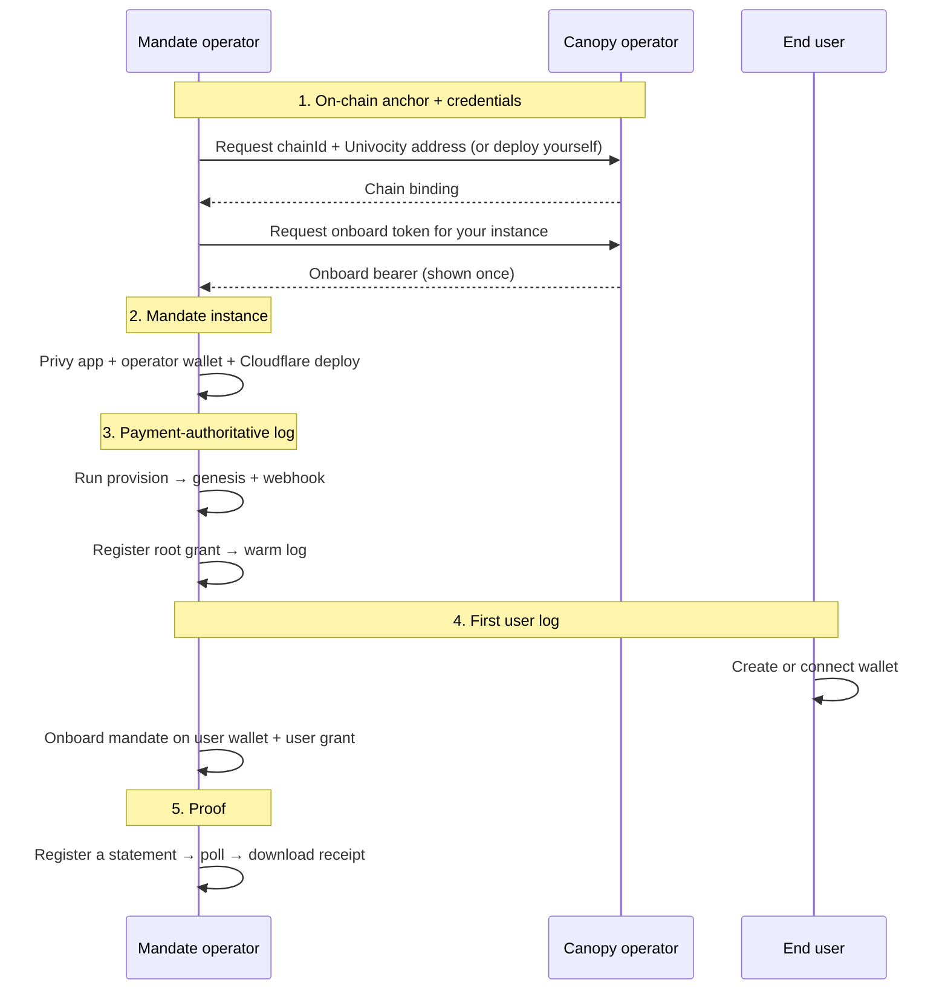
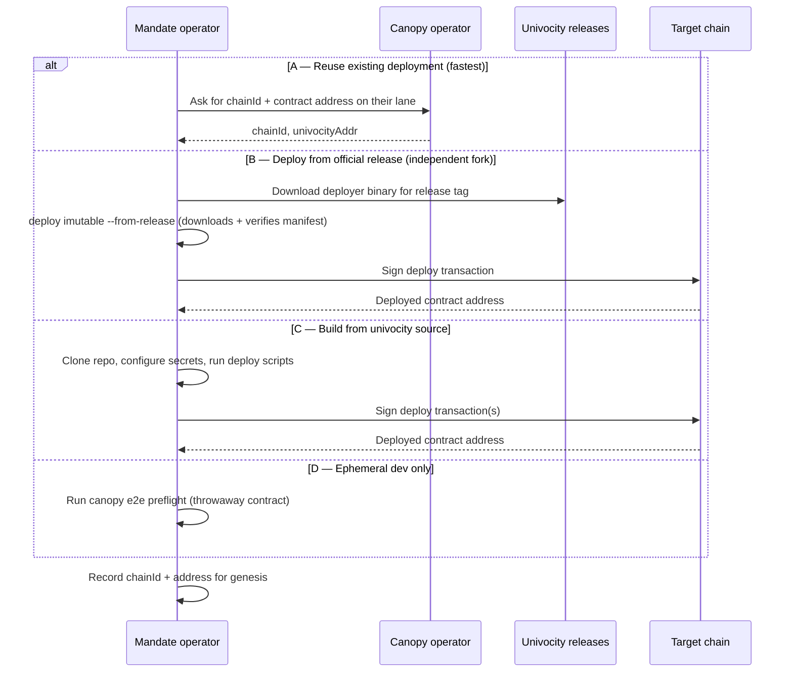
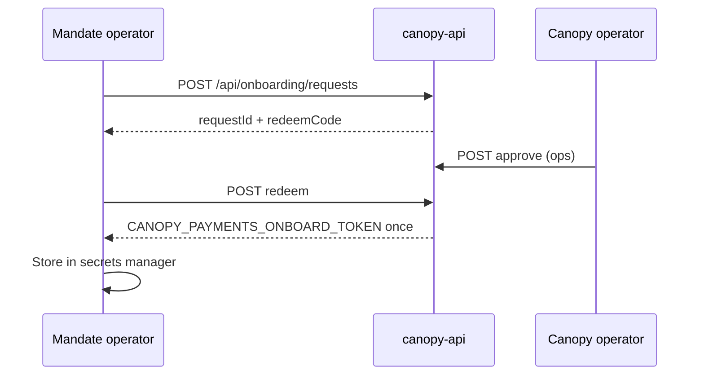
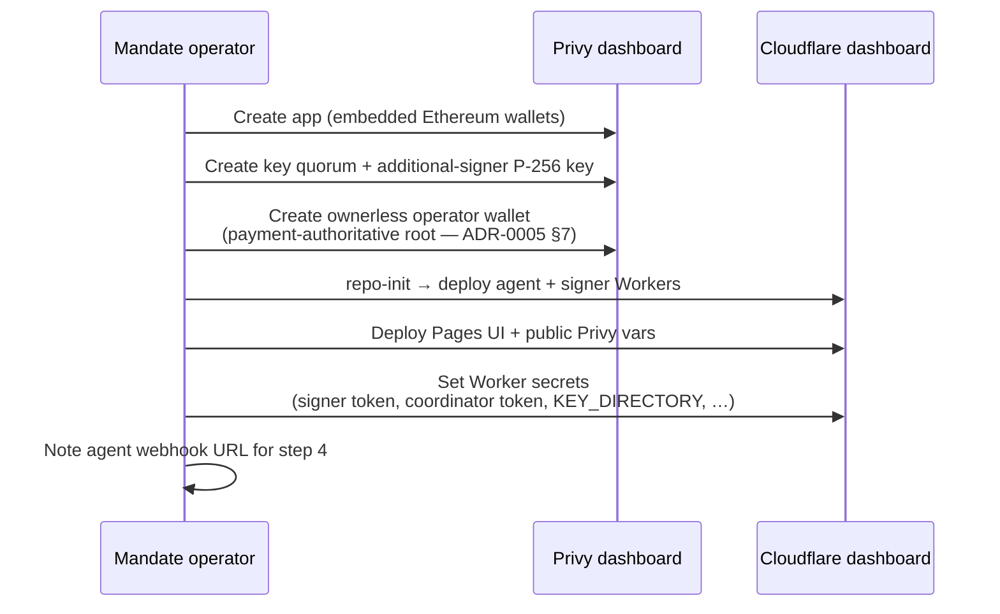
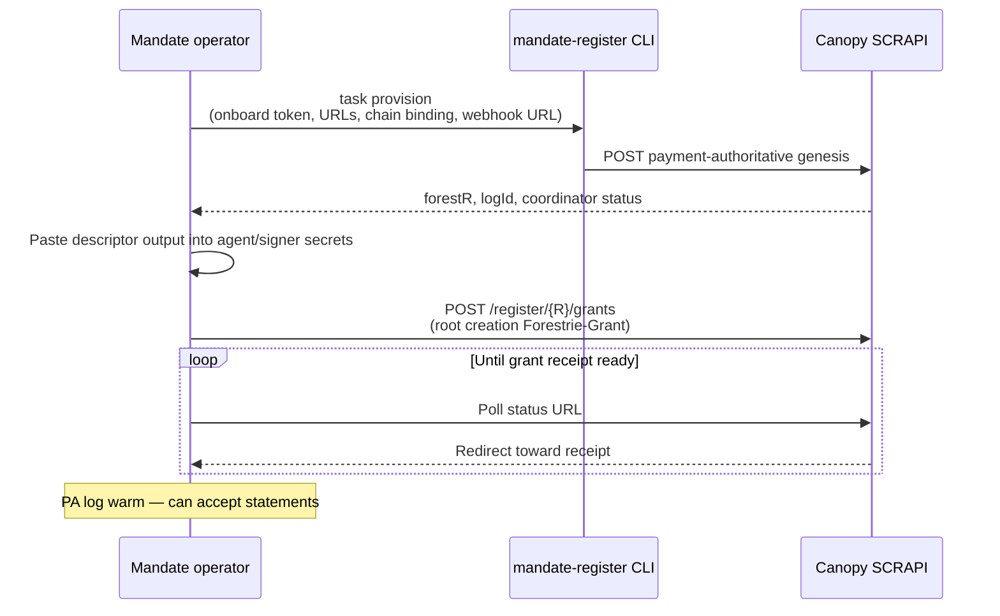
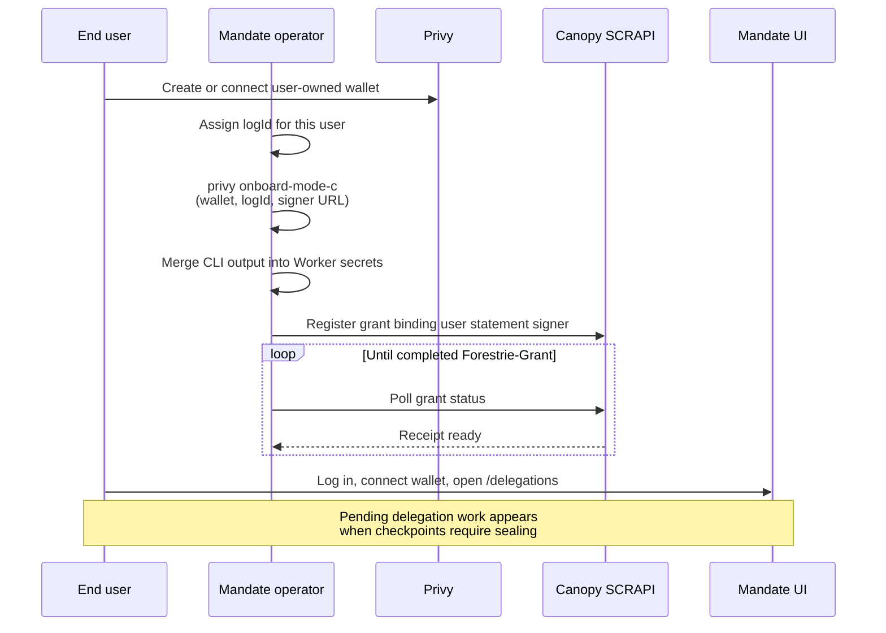
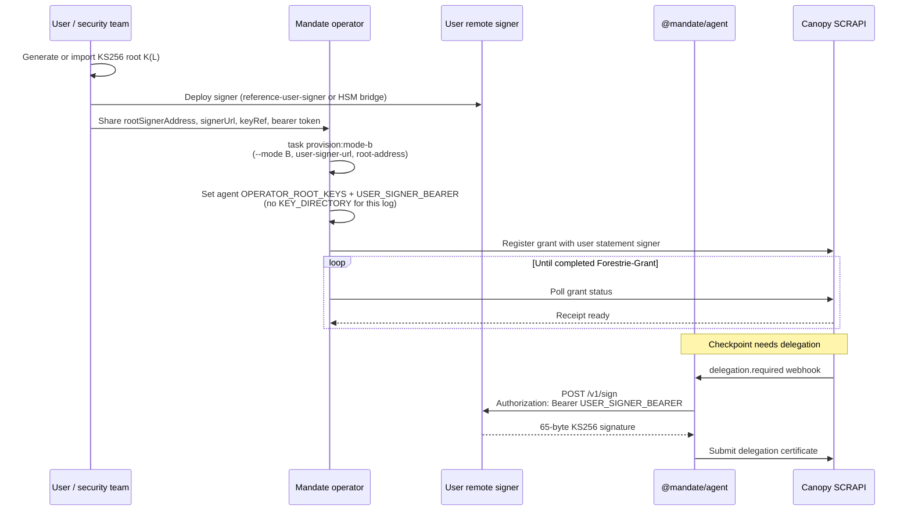
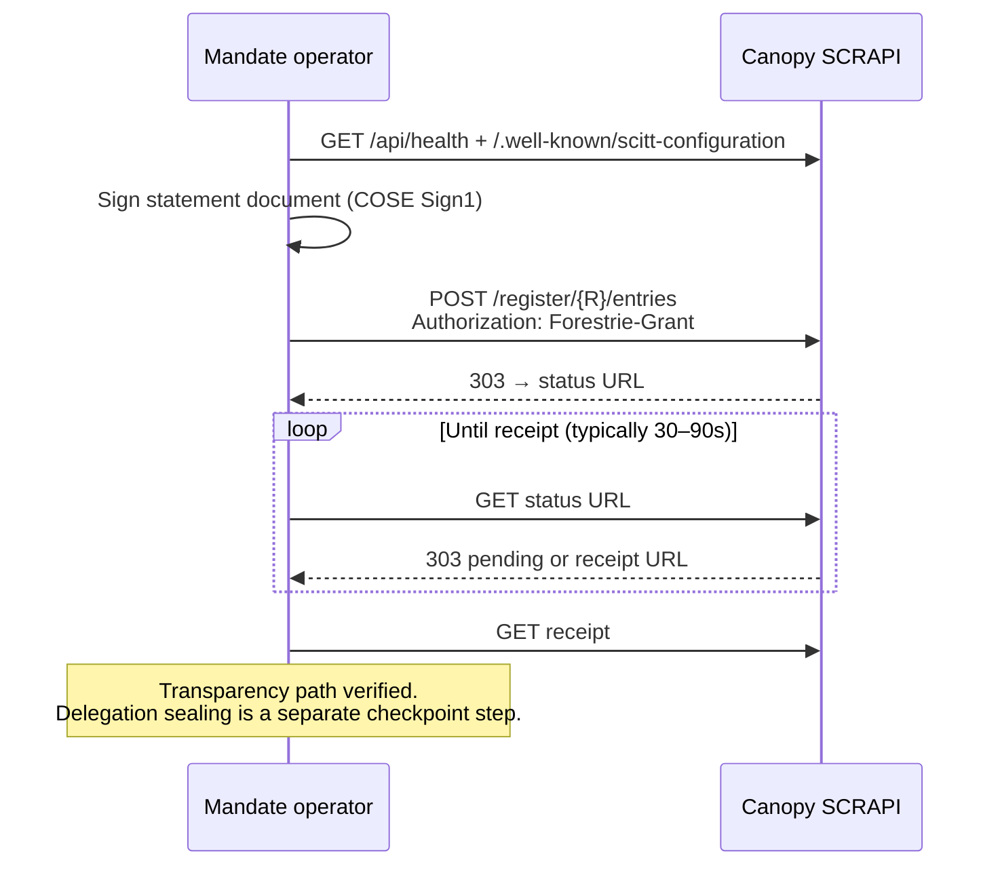
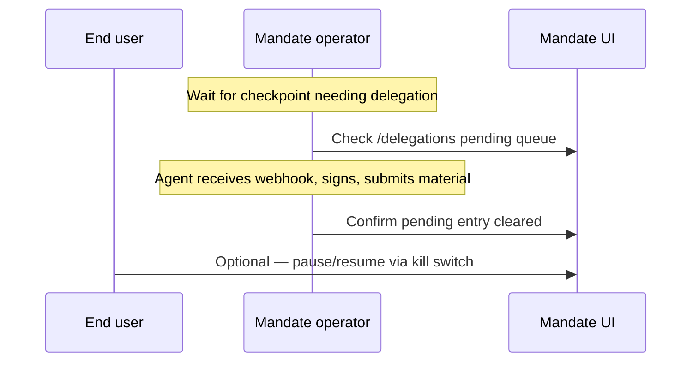

# Forking and running an independent Mandate

**Status:** DRAFT  
**Date:** 2026-06-23  
**Related:** [README.md](README.md), [ADR-0005 BYOK modes](docs/adr/adr-0005-byok-delegation-modes.md),
[ARC-021 payment onboarding](../devdocs/arc/arc-021-payment-onboarding/README.md),
[canopy SCITT hackathon demo](../canopy/docs/demo/scitt-hackathon.md)

Minimal runbook for operating a **forked mandate instance** against a Canopy
SCRAPI stack. Future demos (for example a SCITT hackathon with BYOK sealing)
will point here for **bootstrap**; participant statement flows stay in
[scitt-hackathon.md](../canopy/docs/demo/scitt-hackathon.md).

Diagrams below show **who does what** — operator actions, user actions, and
hand-offs between parties. They omit internal worker/DO behaviour.

---

## Bootstrap overview



Mandate is the **operator console and sealing plane** for BYOK user logs. Canopy
is the **transparency pipe**. You need both, plus an onboard token from whoever
runs the Canopy ops plane.

---

## Prerequisites

| Item                            | Notes                                                                                                       |
| ------------------------------- | ----------------------------------------------------------------------------------------------------------- |
| Git fork of `forestrie/mandate` | `pnpm install` (see [ADR-0004](docs/adr/adr-0004-delegation-cose-distribution.md) for GitHub Packages auth) |
| Cloudflare account              | Pages (`@mandate/ui`) + Workers (agent, signer)                                                             |
| Privy app                       | Dashboard app id + secret; embedded Ethereum wallets enabled                                                |
| Canopy SCRAPI base URL          | e.g. `https://api-a.forest-2.forestrie.dev` or your self-hosted worker                                      |
| Delegation-coordinator URL      | e.g. `https://delegation-coordinator.a.forest-2.forestrie.dev`                                              |
| Chain + Univocity address       | 20-byte contract address bound at genesis                                                                   |
| Onboard bearer token            | From Canopy operator (below) — gates **payment-authoritative** genesis                                      |

Optional for local dev: [Doppler](https://www.doppler.com/) project `mandate-forestrie`
config `dev`, or copy `.dev.vars.example` files under `packages/apps/*`.

---

## 1 — Deploy Univocity (on-chain anchor)

Genesis binds your forest to a **chain id** and **contract address**. Choose one
path:



| Path   | When to use                                                                                                                               |
| ------ | ----------------------------------------------------------------------------------------------------------------------------------------- |
| **A**  | Fork on a shared Forestrie dev lane                                                                                                       |
| **B**  | Independent fork; prebuilt deployer + release tag — no Foundry — see [releases](https://github.com/forestrie/univocity/releases)          |
| **B′** | Same as **B** but in the browser — [univocity-deploy](https://univocity-deploy.pages.dev) (EOA only; manifest + sidecar verified in-page) |
| **C**  | Custom contract changes                                                                                                                   |
| **D**  | Local smoke only — not production                                                                                                         |

**B (detail):** download `deployer-darwin-arm64` or `deployer-linux-x64` from
the [univocity-tools v0.6.0 release](https://github.com/forestrie/univocity-tools/releases/tag/v0.6.0)
(or a newer tag), verify the `.sha256` sidecar, then run one-shot EOA deploy:

```shell
./deployer-darwin-arm64 deploy imutable \
  --from-release v0.1.4 \
  --bootstrap-alg ks256 \
  --bootstrap-ks256-signer 0xYourBootstrapSigner \
  --deploy-key "$DEPLOY_KEY" \
  --rpc-url "$RPC_URL"
```

For ES256 bootstrap, add `--bootstrap-alg es256` and
`--bootstrap-es256-pem "$BOOTSTRAP_PEM_ES256"`.

The command fetches `deploy-manifest-<tag>.json` from the
[Univocity release](https://github.com/forestrie/univocity/releases) when present
(preferred), otherwise the `univocity-<tag>.tar.gz` build archive. Foundry is
not required on the operator machine.

For Safe multisig deploys, use `deploy propose imutable` / `deploy approve` with
`--release-root` or `--from-manifest` (pass `--manifest-sidecar` with the local
`.sha256` file when using a downloaded manifest); see
[univocity-tools CLI docs](https://github.com/forestrie/univocity-tools/blob/main/docs/agents/cli.md).
Safe deploy is **CLI-only** (no browser Safe path).

**B′ (browser):** open [univocity-deploy](https://univocity-deploy.pages.dev),
connect a wallet (Privy or injected MetaMask), select **Base Sepolia (84532)** —
the app switches the wallet off Ethereum mainnet automatically — verify
`deploy-manifest-<tag>.json` and its `.sha256` sidecar (fetched from GitHub or
drag-dropped offline), deploy **ImutableUnivocity** via EOA, then download
`{ chainId, univocityAddr, bootstrapAlg }` for Step 2 below. Integrity model
matches CLI Path B
([ADR-0010](https://github.com/forestrie/univocity-tools/blob/main/docs/adr/adr-0010-deploy-manifest-format.md)).

---

## 2 — Request an onboard token

Payment-authoritative genesis requires a **minted onboard bearer** from the Canopy
registration control plane.

### Self-service (recommended)

After step 1, submit an **onboard request** with your deployed Univocity binding.
The canopy operator approves (or dev lane auto-approves); you **redeem** with the
one-time code to receive the bearer.



```bash
# Request
mandate-register onboard request \
  --canopy-url "$CANOPY_BASE_URL" \
  --label "your-mandate-prod" \
  --chain-id "$CHAIN_ID" \
  --univocity-addr "$UNIVOCITY_ADDR" \
  --contact-email "you@example.com"

# Poll until approved
mandate-register onboard status --canopy-url "$CANOPY_BASE_URL" --request-id "$REQUEST_ID"

# Redeem
mandate-register onboard redeem \
  --canopy-url "$CANOPY_BASE_URL" \
  --request-id "$REQUEST_ID" \
  --redeem-code "$REDEEM_CODE"
```

See [ARC-021.7](../devdocs/arc/arc-021-payment-onboarding/07-self-service-onboard-request.md).

### Break-glass (ops mint)

If you operate canopy yourself or need a manual path:

```bash
curl -sS -X POST "$CANOPY_BASE_URL/api/payments/onboard-tokens" \
  -H "Authorization: Bearer $CANOPY_OPS_ADMIN_TOKEN" \
  -H "Content-Type: application/cbor" \
  --data-binary @<(node -e "const {encode}=require('cbor-x');process.stdout.write(encode(new Map([[1,'your-label']])))")
```

---

## 3 — Deploy mandate Workers and UI

Human setup in Privy and Cloudflare before any forest registration.



Full secret catalog: [service-secrets.md](docs/service-secrets.md). Deploy
detail: [README.md](README.md).

---

## 4 — Register the operator payment-authoritative log

Creates forest root **`R`**, binds Univocity, and registers your agent webhook
with the delegation-coordinator.



### CLI example

**Production:** use the **ownerless app-controlled** operator wallet from step 3
as genesis `bootstrapKey`. The default **Mode C** provision path is a dev/CI
shortcut (user-owned wallet); see [ADR-0005 §7](docs/adr/adr-0005-byok-delegation-modes.md).

```bash
doppler run --project mandate-forestrie --config dev -- \
  task provision \
  --onboard-token "$CANOPY_PAYMENTS_ONBOARD_TOKEN" \
  --canopy-url "$CANOPY_API_URL" \
  --coordinator-url "$DELEGATION_COORDINATOR_URL" \
  --webhook-url "$MANDATE_AGENT_WEBHOOK_URL" \
  --univocity-addr "$CANOPY_UNIVOCITY_ADDR" \
  --chain-id "$CANOPY_CHAIN_ID"
```

| Output field          | Keep                                               |
| --------------------- | -------------------------------------------------- |
| `forestR`             | Bootstrap UUID `R` for SCRAPI paths                |
| `logIdHex32`          | Coordinator / grant log id                         |
| `descriptors`         | `KEY_DIRECTORY` + `OPERATOR_ROOT_KEYS` for Workers |
| `genesis.coordinator` | Expect `publicRoot: ok`, `webhook: ok`             |

Warm-log grant flow matches
[scitt-hackathon Appendix B](../canopy/docs/demo/scitt-hackathon.md#appendix-b--organizer-setup-not-the-main-show).

---

## 5 — Register the first user log

Each user log has its own `logId` and root key `K(L)`. Choose one delegation
mode per user log:

| Mode  | Typical use                        | Where `K(L)` lives      | Mandate sealing path                           |
| ----- | ---------------------------------- | ----------------------- | ---------------------------------------------- |
| **C** | Hosted sealing (default fork path) | User-owned Privy wallet | `@mandate/signer` via `MANDATE_SIGNER_TOKEN`   |
| **B** | Purist BYOK (reference fork path)  | User signer / HSM only  | User `signerUrl` via `bearerEnvKey` env bearer |

**§5a** below is Mode C. **§5b** is Mode B — see
[ADR-0005](docs/adr/adr-0005-byok-delegation-modes.md) and
[CONTEXT.md](CONTEXT.md) (Mode B descriptor, user remote signer).

### 5a — Mode C (hosted sealing)



```bash
doppler run --project mandate-forestrie --config dev -- \
  task privy:onboard:mode-c -- \
  --log-id "<user-log-hex32>" \
  --wallet-id "<privy-wallet-id>" \
  --signer-url "$MANDATE_SIGNER_URL"
```

Mode C adds a `KEY_DIRECTORY` entry on `@mandate/signer` and points
`OPERATOR_ROOT_KEYS.signerUrl` at `MANDATE_SIGNER_URL`. Mandate holds Privy
credentials for signing only — not the user's root private key.

**Separate regular forest per customer:** endorse on `R` with `GF_DERIVED`, then
genesis `R'` ([ARC-021.3](../devdocs/arc/arc-021-payment-onboarding/03-phase-b-regular-forest.md)).
Many forks issue **child grants under the same `R`** instead.

### 5b — Mode B user log (purist BYOK)

In Mode B the user (or their security team) holds `K(L)` in a signer they operate.
Mandate **never** stores the root private key and **does not** add a
`KEY_DIRECTORY` entry for that log. The agent routes delegation signing to the
user's `POST /v1/sign` endpoint with a **separate bearer** (`USER_SIGNER_BEARER`),
not `MANDATE_SIGNER_TOKEN`.

Reference implementation:
[`@mandate/reference-user-signer`](packages/apps/reference-user-signer/README.md)
(FOR-209). Production users may run their own HSM/KMS bridge implementing the same
[ADR-0003](docs/adr/adr-0003-delegation-signer-backend.md) contract.



#### Reader FAQ (Mode B)

| Question                                   | Answer                                                                                                                                                                                                                                                                                                           |
| ------------------------------------------ | ---------------------------------------------------------------------------------------------------------------------------------------------------------------------------------------------------------------------------------------------------------------------------------------------------------------- |
| **D1 — Where is my root key?**             | Only in the user-operated signer (`USER_SIGNER_KEYS_JSON` on the reference Worker, or your KMS). Mandate Workers hold descriptors and bearer tokens, not `K(L)`.                                                                                                                                                 |
| **D2 — What does mandate-signer do?**      | Nothing for this user log. `signerUrl` must **not** be `MANDATE_SIGNER_URL`. `@mandate/signer` remains for Mode C logs and the operator PA wallet only.                                                                                                                                                          |
| **D3 — Same key after Mode C revoke?**     | Yes — [ADR-0005 exit step 3](docs/adr/adr-0005-byok-delegation-modes.md#operational-appendix--mode-c-kill-switch-and-exits-for-114): revoke mandate at Privy, point `OPERATOR_ROOT_KEYS.signerUrl` at the user's signer, set `bearerEnvKey: USER_SIGNER_BEARER`. `publicRoot` is unchanged — no re-registration. |
| **D4 — Which bearer does the agent send?** | The env named by `bearerEnvKey` on the descriptor (default `USER_SIGNER_BEARER`). It must match the user signer's bearer. Empty env → agent fails closed (no fallback to `MANDATE_SIGNER_TOKEN`).                                                                                                                |

#### Mode B vs Mode C — what mandate never holds (user log)

| Secret / config                    | Mode C (hosted)                 | Mode B (purist BYOK)                      |
| ---------------------------------- | ------------------------------- | ----------------------------------------- |
| User root private key              | Never (Privy TEE)               | **Never** (user signer only)              |
| `KEY_DIRECTORY` entry for user log | Yes (`walletId`, auth key path) | **No** — empty `{}` from Mode B provision |
| `OPERATOR_ROOT_KEYS.signerUrl`     | `MANDATE_SIGNER_URL`            | User `signerUrl` (≠ mandate-signer)       |
| Agent bearer for remote sign       | `MANDATE_SIGNER_TOKEN`          | `USER_SIGNER_BEARER` via `bearerEnvKey`   |
| Privy additional-signer policy     | Required                        | Not used for this log                     |

#### Deploy reference user signer

```bash
# Doppler dev: USER_SIGNER_BEARER + USER_SIGNER_KEYS_JSON
task deploy:reference-user-signer
# Record deployed URL as E2E_USER_SIGNER_URL (e2e) or operator secret
```

See [packages/apps/reference-user-signer/README.md](packages/apps/reference-user-signer/README.md).

#### Provision Mode B user log

Use the user's `rootSignerAddress` as genesis `bootstrapKey`. Align `forest-r`
(or the generated `logIdHex32`) with the log id in `USER_SIGNER_KEYS_JSON`.

```bash
doppler run --project mandate-forestrie --config dev -- \
  doppler run --project mandate-forestrie --config e2e -- \
  task provision:mode-b -- \
  --onboard-token "$CANOPY_PAYMENTS_ONBOARD_TOKEN" \
  --canopy-url "$CANOPY_API_URL" \
  --coordinator-url "$DELEGATION_COORDINATOR_URL" \
  --webhook-url "$MANDATE_AGENT_WEBHOOK_URL" \
  --univocity-addr "$CANOPY_UNIVOCITY_ADDR" \
  --chain-id "$CANOPY_CHAIN_ID" \
  --root-address "0x<UserKs256RootAddress>" \
  --user-signer-url "$USER_SIGNER_URL" \
  --key-ref "user-remote" \
  --forest-r "<dashed-uuid-matching-signer-keys-json-log-id>"
```

Expect provision output:

| Field                                              | Mode B expectation                       |
| -------------------------------------------------- | ---------------------------------------- |
| `descriptors.keyDirectory`                         | `{}`                                     |
| `descriptors.operatorRootKeys[logId].signerUrl`    | User signer URL (≠ `MANDATE_SIGNER_URL`) |
| `descriptors.operatorRootKeys[logId].bearerEnvKey` | `USER_SIGNER_BEARER`                     |

Merge into agent Worker secrets:

- `OPERATOR_ROOT_KEYS` — JSON from provision (or append per-log entry)
- `USER_SIGNER_BEARER` — same bearer the user signer expects
- Do **not** add a user-log row to signer `KEY_DIRECTORY`

Example descriptor (one log):

```json
{
	"a1b2c3d4e5f678901234567890abcdef0": {
		"alg": "KS256",
		"rootSignerAddress": "0x…",
		"kind": "remote",
		"signerUrl": "https://mandate-reference-user-signer.<account>.workers.dev/v1/sign",
		"keyRef": "user-remote",
		"bearerEnvKey": "USER_SIGNER_BEARER"
	}
}
```

#### Grant registration and sealing

After provision, register the user's statement-signing grant on Canopy (same
shape as §5a). When checkpoints require delegation, the coordinator webhook
hits `@mandate/agent`, which POSTs to the **user signer URL** with
`USER_SIGNER_BEARER`. Live verification: `task test:live:mode-b` (FOR-210).

#### Exit from Mode C to Mode B (same key)

After [Privy revoke](docs/service-secrets.md#post-revoke-secret-hygiene-for-131)
(ADR-0005 exit step 2), an operator may switch the log to Mode B without
re-registering grants:

1. Deploy or expose the user's `POST /v1/sign` endpoint.
2. Update `OPERATOR_ROOT_KEYS` for that `logId`: `signerUrl` → user URL,
   `bearerEnvKey: USER_SIGNER_BEARER`, remove Mode C `keyRef` mapping to Privy.
3. Set agent `USER_SIGNER_BEARER`; prune the Mode C `KEY_DIRECTORY` entry on
   `@mandate/signer` if no other log uses it.
4. Confirm sealing via webhook (or `task test:live:mode-b` in CI).

Thin agent index: [docs/agents/mode-b-fork.md](docs/agents/mode-b-fork.md).

---

## 6 — Prove the setup: register a statement (SCRAPI)

Confirms Canopy accepts grants and produces receipts. Same participant shape as
[scitt-hackathon Part 1](../canopy/docs/demo/scitt-hackathon.md#part-1--participant-flow).



### Commands

```bash
export CANOPY_BASE_URL="https://api.example.com"
export BOOTSTRAP_LOG_ID="<forestR from step 4>"
export COMPLETED_GRANT_B64="<base64 Forestrie-Grant>"

curl -sS "$CANOPY_BASE_URL/api/health" | jq .
curl -sS "$CANOPY_BASE_URL/.well-known/scitt-configuration" | jq .

curl -sS -D headers.txt -o /dev/null -X POST \
  "$CANOPY_BASE_URL/register/$BOOTSTRAP_LOG_ID/entries" \
  -H "Authorization: Forestrie-Grant $COMPLETED_GRANT_B64" \
  -H 'Content-Type: application/cose; cose-type="cose-sign1"' \
  --data-binary @statement.cose
```

Poll for receipt (expect **303** chain ending in `/receipt`):

```bash
STATUS_URL="$(grep -i '^location:' headers.txt | cut -d' ' -f2- | tr -d '\r')"
case "$STATUS_URL" in http*) ;; *) STATUS_URL="$CANOPY_BASE_URL$STATUS_URL" ;; esac

while true; do
  curl -sS -D poll-headers.txt -o /dev/null "$STATUS_URL"
  LOC="$(grep -i '^location:' poll-headers.txt | cut -d' ' -f2- | tr -d '\r')"
  echo "$(date -u +%H:%M:%S) → $LOC"
  case "$LOC" in */receipt) RECEIPT_URL="$LOC"; break ;; esac
  sleep 2
done

case "$RECEIPT_URL" in http*) ;; *) RECEIPT_URL="$CANOPY_BASE_URL$RECEIPT_URL" ;; esac
curl -sS "$RECEIPT_URL" -o receipt.cbor
```

### Optional — delegation round-trip



---

## Credential cheat sheet

| Credential                      | Who holds it         | Gates                                                                       |
| ------------------------------- | -------------------- | --------------------------------------------------------------------------- |
| `CANOPY_OPS_ADMIN_TOKEN`        | Canopy operator      | Mint onboard tokens                                                         |
| `CANOPY_PAYMENTS_ONBOARD_TOKEN` | Mandate operator     | PA genesis only                                                             |
| `Forestrie-Grant`               | User / operator keys | Grants + statements                                                         |
| `COORDINATOR_APP_TOKEN`         | Mandate infra        | Coordinator service APIs                                                    |
| Control-plane session           | User wallet          | Coordinator UX APIs (v1) — [ADR-0001](docs/adr-0001-auth-strategy-seams.md) |

---

## Troubleshooting

| Symptom                         | Check                                         |
| ------------------------------- | --------------------------------------------- |
| Genesis 401                     | Onboard token wrong or revoked                |
| Genesis 503 coordinator         | Webhook URL unreachable from Canopy           |
| Statement 403 `signer_mismatch` | Statement signer ≠ grant binding              |
| Receipt poll never completes    | Ask Canopy operator: Ranger + Sealer health   |
| Agent never seals               | Webhook URL, Worker secrets, log enabled flag |

---

## Further reading

- [README.md](README.md) — monorepo dev, CI, Workers deploy
- [CONTEXT.md](CONTEXT.md) — mandate glossary
- [canopy grants.md](../canopy/docs/grants.md) — grant shapes and register rules
- [ARC-021 end-to-end](../devdocs/arc/arc-021-payment-onboarding/06-end-to-end.md) — registration control plane
- [scitt-hackathon.md](../canopy/docs/demo/scitt-hackathon.md) — participant SCRAPI demo
- [docs/agents/mode-b-fork.md](docs/agents/mode-b-fork.md) — Mode B agent index (→ §5b)
