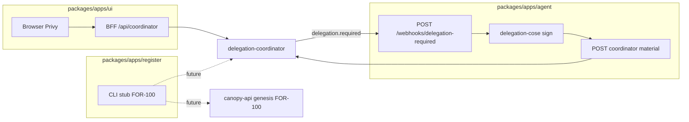

# Plan 0003: Mandate package split (FOR-97)

**Status:** DRAFT  
**Date:** 2026-06-21  
**Linear:** [FOR-97](https://linear.app/forestrie/issue/FOR-97/mandate-split-into-ui-agent-register-packages)  
**Related:**

- [FOR-98](https://linear.app/forestrie/issue/FOR-98) webhook receiver + signer (pulled forward into `agent`)
- [FOR-100](https://linear.app/forestrie/issue/FOR-100) provisioning (`register` skeleton only here)
- [FOR-94](https://linear.app/forestrie/issue/FOR-94) `@canopy/delegation-cose` (done — consume from sibling canopy)
- [FOR-92/93](https://linear.app/forestrie/issue/FOR-92) coordinator webhook CRUD + delivery (done — `agent` implements receiver side)
- [docs/adr-0001-auth-strategy-seams.md](../adr-0001-auth-strategy-seams.md)
- [devdocs arc-021.6 end-to-end](../../../devdocs/arc/arc-021-payment-onboarding/06-end-to-end.md)
- [canopy adr-0005 delegation webhook delivery](../../../canopy/docs/adr/adr-0005-delegation-webhook-delivery.md)
- [canopy adr-0006 webhook source authentication](../../../canopy/docs/adr/adr-0006-webhook-source-authentication.md)

## Purpose

Restructure the flat Mandate repo into three buildable packages — **`ui`**, **`agent`**, **`register`** — so Mandate is an independently deployable example of a webhook × Univocity instance management tool, not tied to Forestrie's own instance.

**Scope decision (grill Q1):** Structural split **plus a functional `agent`** (real `delegation.required` receiver, signature verify, `@canopy/delegation-cose` sign, material submit). **`register` stays a skeleton** (buildable package + typed config surface stub; FOR-100 implements provisioning).

## Grill decisions (resolved)

| #   | Question                  | Decision                                                   | Rationale                                                                              |
| --- | ------------------------- | ---------------------------------------------------------- | -------------------------------------------------------------------------------------- |
| Q1  | Scope                     | Structural + functional `agent`; skeleton `register`       | User choice; keeps FOR-97 bounded while leveraging completed FOR-92/93/94              |
| Q2  | Monorepo layout           | pnpm workspace; deployables under `packages/apps/`         | Matches canopy convention; mandate already uses pnpm                                   |
| Q3  | `ui` deploy unit          | Cloudflare **Pages** (unchanged)                           | Existing GHA + Doppler path; SvelteKit BFF stays here                                  |
| Q4  | `agent` deploy unit       | Dedicated Cloudflare **Worker**                            | Public webhook URL, headless signing, independent lifecycle from console               |
| Q5  | `register` shape          | Library + thin CLI stub (`register --help`)                | FOR-100 adds genesis + webhook registration; no canopy calls in FOR-97                 |
| Q6  | `@canopy/delegation-cose` | `file:` dependency on sibling canopy checkout              | Package is `private: true` workspace-only today; publishing deferred                   |
| Q7  | Shared code               | `@mandate/coordinator-types` workspace lib                 | Replaces `scripts/sync-coordinator-types.mjs` copy-into-src pattern                    |
| Q8  | `ui` signing path         | Keep browser Privy path unchanged in FOR-97                | Pull console (ui) and push webhook (agent) are parallel v1 paths; converge later       |
| Q9  | Agent dedup store         | Worker **KV** namespace `REQUEST_KEYS`                     | Simple idempotency for redelivered webhooks; TTL aligned with coordinator pending (1h) |
| Q10 | Agent root signing key    | Env secret `DELEGATION_ROOT_PRIVATE_KEY_PEM` (ES256 P-256) | Matches coordinator ES256 material validation path for v1 BYOK; KS256 env hook stubbed |

## Target topology

```text
mandate/                          # pnpm workspace root
├── pnpm-workspace.yaml
├── package.json                  # workspace scripts: build, test, lint, check
├── CONTEXT.md                    # domain glossary (new)
├── packages/
│   ├── apps/
│   │   ├── ui/                   # SvelteKit → Cloudflare Pages (current app)
│   │   ├── agent/                # Cloudflare Worker — webhook + signer
│   │   └── register/             # CLI/lib skeleton (FOR-100)
│   └── libs/
│       └── coordinator-types/    # synced from canopy delegation-coordinator
├── docs/
│   ├── adr-0002-package-topology-and-agent-worker.md  (new)
│   └── plans/plan-0003-for-97-package-split.md        (this file)
└── .github/workflows/            # per-package or matrix build/test/deploy
```



## Package responsibilities

### `packages/apps/ui` (operator console)

**Moves from repo root:** all of today's `src/`, `static/`, `svelte.config.js`, `vite.config.ts`, ui-specific `wrangler.jsonc`, `.env.example` public vars.

**Keeps:**

- Landing + `/delegations` Privy console
- Coordinator BFF proxy (`/api/coordinator/*`)
- Browser KS256 signing via local `ks256-payload.ts` (retire later when ui delegates to agent — out of scope)

**Changes:**

- Import coordinator types from `@mandate/coordinator-types` instead of `src/lib/coordinator/types/*`
- Root scripts delegate: `pnpm --filter @mandate/ui dev`

**Acceptance:** Same UX as today; `pnpm --filter @mandate/ui build` + existing Pages deploy green.

### `packages/apps/agent` (delegation agent — FOR-98 pulled forward)

**New Cloudflare Worker** implementing the receiver side of FOR-93.

**Routes:**

| Method | Path                            | Purpose                          |
| ------ | ------------------------------- | -------------------------------- |
| `POST` | `/webhooks/delegation-required` | Receive `delegation.required` v1 |
| `GET`  | `/health`                       | Liveness                         |

**Handler flow (implement against FOR-93 contract):**

1. Read raw body; parse `DelegationRequiredEvent` (`type`, `version`, `requestKey`, `logId`, `authLogId`, `mmrStart`, `mmrEnd`, `delegatedPublicKey` base64, `materialSubmitUrl`, `requestedAt`).
2. Verify `X-Forestrie-Webhook-Signature` over `{timestamp}.{rawBody}` using ES256 public key from coordinator `GET /.well-known/forestrie-webhook-jwks.json` (cache JWKS in Worker memory with short TTL).
3. **Dedup:** if `requestKey` exists in KV → return `200 { ok: true, duplicate: true }`.
4. Decode `delegatedPublicKey` from base64 → CBOR bytes.
5. Build certificate via `@canopy/delegation-cose`:
   - `buildDelegationCertificateEs256WithSigner(input, rootKid, sign)` where `sign` uses `DELEGATION_ROOT_PRIVATE_KEY_PEM`.
   - `DelegationInput`: `logIdHex32`, `mmrStart`, `mmrEnd`, `delegatedPublicKeyCbor`, TTL from env or default 3600s.
6. `POST {materialSubmitUrl}` (or `COORDINATOR_UPSTREAM_URL/api/delegations/material`) with `SubmitMaterialRequest` JSON + `Authorization: Bearer ${COORDINATOR_APP_TOKEN}`.
7. Store `requestKey` in KV with TTL 3600s; return `200 { ok: true }`.

**Env / secrets:**

| Name                              | Purpose                         |
| --------------------------------- | ------------------------------- |
| `COORDINATOR_UPSTREAM_URL`        | Coordinator base                |
| `COORDINATOR_APP_TOKEN`           | Material submit auth            |
| `DELEGATION_ROOT_PRIVATE_KEY_PEM` | ES256 root key for cert signing |
| `REQUEST_KEYS`                    | KV binding                      |

**Leverage completed work:**

- Event shape: `canopy/.../types/delegation-required-event.ts`
- Signature verify: mirror `canopy/.../webhook/signing-key.ts` verify path (or extract shared verify helper into agent — do not depend on coordinator private code)
- Material body: `SubmitMaterialRequest` from `@mandate/coordinator-types`

**Tests (vitest + miniflare):**

- Golden: valid signed webhook → material POST mocked → KV dedup on replay
- Reject: bad signature, wrong `type`, malformed body
- Optional integration: point at local coordinator vitest fixture pattern from `webhook-delivery.test.ts`

**Deploy:** new GHA workflow `deploy-agent.yml` → `mandate-agent-dev` / `mandate-agent-prod` Workers; Doppler config `agent-dev` / `agent-prod` or extend existing `mandate` project with agent secrets.

### `packages/apps/register` (skeleton)

**Deliver:**

- `@mandate/register` export surface: `RegisterConfig` type (onboard token, canopy base URL, coordinator URL, webhook URL placeholder, operator key source enum).
- CLI via minimal parser: `register --help`, `register provision --help` → exit 0 with "not implemented — see FOR-100".
- `package.json` with `bin`, `typecheck`, empty vitest smoke test.

**Document FOR-100 wiring (comments + README only):**

1. `POST /api/forest/{R}/genesis` with onboard bearer (canopy M1)
2. `PUT /api/logs/{logId}/webhook` with `{ url: agentPublicUrl }` (FOR-92)

No network calls in FOR-97.

### `packages/libs/coordinator-types`

**Moves:** output of `scripts/sync-coordinator-types.mjs` → committed/synced types package.

**Script update:** `pnpm sync:coordinator-types` writes into `packages/libs/coordinator-types/src/` from `canopy/packages/apps/delegation-coordinator/src/types/`.

**Consumers:** `ui`, `agent`, `register`.

## `@canopy/delegation-cose` consumption

In `packages/apps/agent/package.json`:

```json
{
	"dependencies": {
		"@canopy/delegation-cose": "file:../../../../canopy/packages/libs/delegation-cose",
		"@mandate/coordinator-types": "workspace:*"
	}
}
```

**CI requirement:** checkout canopy sibling in GHA (sparse) or document mandatory sibling layout for local dev. Add README note:

```text
forestrie/
  canopy/    ← required sibling for agent build
  mandate/
```

**Transitive:** pnpm resolves `@canopy/encoding` from delegation-cose automatically.

**Follow-up (not FOR-97):** publish `@canopy/delegation-cose` to GitHub Packages or npm when mandate must build without sibling checkout.

## Migration steps (implementation order)

### Phase 1 — Workspace scaffold

1. Add root `pnpm-workspace.yaml`, root `package.json` with `build`, `test`, `lint`, `check` aggregating filters.
2. Create empty package shells with `package.json`, `tsconfig.json` extends root.
3. Move current app → `packages/apps/ui/` (git mv preserves history).
4. Fix relative paths in ui configs, GHA, Taskfile, Doppler task paths.
5. CI green with ui-only (no behavior change).

### Phase 2 — Shared types lib

1. Create `packages/libs/coordinator-types`; run sync script once.
2. Update ui imports; delete `packages/apps/ui/src/lib/coordinator/types/*`.
3. Add re-export barrel; vitest smoke on type imports.

### Phase 3 — Functional agent

1. Scaffold Worker with wrangler.toml, miniflare vitest.
2. Implement webhook verify + dedup + delegation-cose sign + material submit.
3. Unit tests with fixture payloads from coordinator `webhook-delivery.test.ts`.
4. Add deploy workflow + Doppler secrets doc.
5. Manual dev test: register agent URL on coordinator via FOR-92 PUT, trigger issue miss, observe material + pending resolve.

### Phase 4 — Register skeleton

1. `RegisterConfig` type aligned with FOR-100 + arc-021.6 credential layers.
2. CLI stub + README pointing to FOR-100.
3. Workspace build includes all three apps.

### Phase 5 — Docs + glossary

1. Create root `CONTEXT.md` (see terms below).
2. Add `docs/adr-0002-package-topology-and-agent-worker.md`.
3. Update root README with monorepo layout + sibling canopy requirement.

## Behaviors to test (TDD)

| Behavior                                       | Package  | Test type                                  |
| ---------------------------------------------- | -------- | ------------------------------------------ |
| ui BFF still allowlists coordinator paths      | ui       | vitest (move existing `bff-proxy.spec.ts`) |
| ui build produces Pages output                 | ui       | CI build                                   |
| agent rejects webhook with invalid signature   | agent    | vitest + miniflare                         |
| agent accepts valid webhook and POSTs material | agent    | vitest (mock fetch)                        |
| agent dedups on `requestKey` redelivery        | agent    | vitest + KV                                |
| register CLI `--help` exits 0                  | register | vitest                                     |
| workspace `pnpm test` runs all packages        | root     | CI                                         |

## CONTEXT.md terms (create in Phase 5)

| Term                         | Definition                                                                                                                                                           |
| ---------------------------- | -------------------------------------------------------------------------------------------------------------------------------------------------------------------- |
| **Operator console**         | Browser UI where a Mandate operator lists pending delegations and may sign manually. _Avoid:_ "wallet app" (implies custodial product).                              |
| **Delegation agent**         | Headless Worker that receives `delegation.required` webhooks and submits signed delegation material non-custodially. _Avoid:_ "signer service" (too generic).        |
| **Registration provisioner** | Component that creates a Univocity instance on canopy and registers the agent webhook on the coordinator. _Avoid:_ "onboarding script" (ops token flow is separate). |
| **Coordinator BFF**          | ui-only same-origin proxy that injects coordinator auth; secrets never reach the browser.                                                                            |

## ADR candidate

**ADR-0002: Package topology and agent as dedicated Worker**

- Hard to reverse: deploy pipelines, Doppler projects, operator runbooks split across two Cloudflare products.
- Surprising: today mandate is one Pages app; webhook lives on a separate Worker URL.
- Trade-off: Pages Functions could host webhook, but couples console deploy to signing availability and complicates fork-friendly independent deploy (FOR-99).

## Out of scope (explicit)

- FOR-100 genesis + webhook registration implementation
- Retiring ui browser signing in favor of agent
- KS256 agent signing (stub env hook only; ES256 v1)
- Publishing `@canopy/delegation-cose`
- Mandate fork-friendly deploy (FOR-99)
- End-to-end mandate e2e (FOR-101)

## Acceptance (FOR-97)

- [ ] Three buildable workspace packages: `@mandate/ui`, `@mandate/agent`, `@mandate/register`
- [ ] Existing ui functionality preserved (delegations console + BFF)
- [ ] Agent implements FOR-98 core path against FOR-93 contract with tests
- [ ] Register skeleton with typed config + CLI help
- [ ] CI green: lint, check, test, build (all packages)
- [ ] `CONTEXT.md` + ADR-0002 landed

## Ops notes

- Agent public URL must be registered via coordinator `PUT /api/logs/{logId}/webhook` (FOR-92) — manual until FOR-100.
- Ensure `CANOPY_OPS_ADMIN_TOKEN` / onboard flow stays in canopy; agent uses `COORDINATOR_APP_TOKEN` only.
- Prod: add agent Worker secrets before demo; ui and agent deploy independently.
