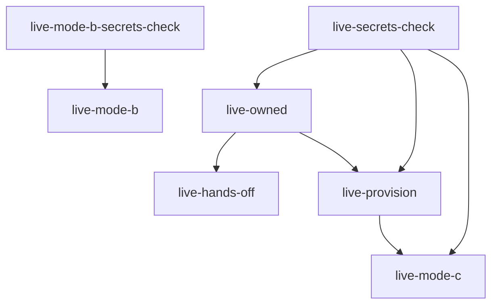

# Mandate secrets catalog

**Decision record:** [ADR-0006](adr/adr-0006-privy-secrets.md). **Glossary:**
[CONTEXT.md](../CONTEXT.md) — operational secret, E2E fixture secret, Mode C user
wallet.

One env var / Wrangler binding name everywhere (Doppler, GitHub, Workers, tests,
CLI). **Hard cutover** — no legacy aliases. CI enforces via
`scripts/check-legacy-secret-names.mjs`.

## Secret taxonomy

| Prefix                   | Meaning                                                            | Doppler config    | GitHub environment                          |
| ------------------------ | ------------------------------------------------------------------ | ----------------- | ------------------------------------------- |
| `MANDATE_`               | Long-lived mandate **instance** secrets                            | `dev`, `prod`     | `prod`; operational subset on `live-signer` |
| `E2E_`                   | Synthetic users, test wallets, dev Canopy/coordinator URLs         | **`e2e` only**    | **`live-signer` only** — never `prod`       |
| `PUBLIC_MANDATE_PRIVY_*` | UI Privy SDK ids (public, not secret)                              | `dev`/`prod` vars | GitHub `vars` on Pages deploy               |
| `VITE_E2E_PRIVY_MOCK`    | Build-time mock Privy for Playwright (`true` only); **never prod** | local / CI only   | ui-e2e workflow only — not Doppler `prod`   |

Never sync `E2E_*` secrets to production Workers or the `prod` GitHub environment.

## Operational secrets (`MANDATE_*`)

Doppler `mandate-forestrie` configs **`dev`** and **`prod`**.

| Name                              | Purpose                                                                                                                                         |
| --------------------------------- | ----------------------------------------------------------------------------------------------------------------------------------------------- |
| `MANDATE_PRIVY_APP_ID`            | Privy application id (also in signer `wrangler.env.prod.json` vars)                                                                             |
| `MANDATE_PRIVY_APP_SECRET`        | Privy app secret (Basic auth)                                                                                                                   |
| `MANDATE_PRIVY_SIGNER_ID`         | Mandate key quorum id (one per deployment)                                                                                                      |
| `MANDATE_PRIVY_AUTHORIZATION_KEY` | Mandate additional-signer P-256 key (`wallet-auth:` + base64 PKCS#8 DER); signs Privy authorization header for user-owned wallets (ADR-0003 S3) |
| `MANDATE_PRIVY_API_BASE`          | Privy API base URL (required; no code default)                                                                                                  |
| `MANDATE_SIGNER_URL`              | Deployed `@mandate/signer` `POST /v1/sign` URL (CI live tests)                                                                                  |
| `MANDATE_SIGNER_TOKEN`            | Bearer auth on signer `POST /v1/sign`                                                                                                           |
| `USER_SIGNER_BEARER`              | Mode B user remote signer bearer (when descriptor sets `bearerEnvKey`)                                                                          |
| `COORDINATOR_APP_TOKEN`           | Bearer for coordinator material submit                                                                                                          |
| `COORDINATOR_UPSTREAM_URL`        | Coordinator origin (agent var)                                                                                                                  |
| `OPERATOR_ROOT_KEYS`              | JSON map of per-log signer descriptors                                                                                                          |
| `KEY_DIRECTORY`                   | Signer wallet directory JSON                                                                                                                    |
| `CLOUDFLARE_API_TOKEN`            | Wrangler deploy / KV                                                                                                                            |
| `CLOUDFLARE_ACCOUNT_ID`           | Target Cloudflare account                                                                                                                       |
| `PUBLIC_MANDATE_PRIVY_APP_ID`     | UI client Privy app id                                                                                                                          |
| `PUBLIC_MANDATE_PRIVY_CLIENT_ID`  | UI client Privy client id                                                                                                                       |
| `PUBLIC_DEFAULT_CHAIN_ID`         | UI default EVM chain id (`84532` = Base Sepolia dev; used for Privy wallet alignment)                                                           |
| `VITE_E2E_PRIVY_MOCK`             | Set to `true` for hermetic Playwright ui-e2e preview build only; omit in prod CI (see plan-0047)                                                |

`MANDATE_PRIVY_AUTHORIZATION_KEY` is **operational**, not per-user. Real Mode C
users never store owner keys in Doppler; only the synthetic test user owner key is
`E2E_*`.

## Operator fee collection (`X402_*`)

Agent worker only, for `POST /grants`. This operator collects **its own** fees at
**its own** address (FOR-428, ADR-0058). Canopy is not in this path and learns
nothing about these values.

**There is no compiled-in default for any of them, deliberately.** A fallback
would settle a fork's customers' money to whichever address the fallback names —
i.e. upstream's. `POST /grants` therefore **fails closed**: with any of these
unset it answers `503` and issues no challenge at all, rather than paywalling to
a foreign payee. Set them per environment; a dev payment must not be
indistinguishable from a production one.

| Name                             | Required | Purpose                                                        |
| -------------------------------- | -------- | -------------------------------------------------------------- |
| `X402_PAYTO_ADDRESS`             | yes      | This operator's own settlement address                         |
| `X402_PRICE_ATOMIC`              | yes      | Grant price in the asset's atomic units (USDC has 6 decimals)  |
| `X402_NETWORK`                   | yes      | CAIP-2 settlement chain, e.g. `eip155:84532`                   |
| `X402_ASSET_ADDRESS`             | yes      | ERC-20 settlement asset on `X402_NETWORK` (chain-specific)     |
| `X402_FACILITATOR_URL`           | yes      | Facilitator base URL used to `verify` then `settle`            |
| `X402_ASSET_EIP712_NAME`         | no       | Asset EIP-712 domain name; defaults to the ERC-20 usual `USDC` |
| `X402_ASSET_EIP712_VERSION`      | no       | Asset EIP-712 domain version; defaults to `2`                  |
| `X402_FACILITATOR_AUTHORIZATION` | no       | Bearer for facilitators that require credentials               |

The two `EIP712` values are properties of the ERC-20 contract named by
`X402_ASSET_ADDRESS`, not economic configuration, which is why they alone carry
conventional defaults.

## E2E fixture secrets (`E2E_*`)

Doppler config **`e2e`** only. GitHub **`live-signer`** only.

### Privy wallet roles (E2E)

Three wallet topologies; see CONTEXT.md and ADR-0005 §7.

| Role                           | Env vars                                             | Topology                                       | Mutated by tests?                  |
| ------------------------------ | ---------------------------------------------------- | ---------------------------------------------- | ---------------------------------- |
| Operator payment-authoritative | \_(operational `KEY_DIRECTORY` only; not `E2E\__`)\* | Ownerless app-controlled; no additional signer | No                                 |
| Signer test wallet             | `E2E_SIGNER_TEST_*`                                  | User-owned; mandate = additional signer        | **No** — stable success path       |
| Mode C kill-switch wallet      | `E2E_MODE_C_USER_*`                                  | User-owned; mandate = additional signer        | **Yes** — onboard, revoke, restore |

The retired early `mandate-forestrie` wallet (ownerless + mandate additional
signer; renamed **`mandate-forestrie-archived`** in Privy) must not be referenced.

| Name                                | Synthetic role                                                      | Tests that mutate                                                 |
| ----------------------------------- | ------------------------------------------------------------------- | ----------------------------------------------------------------- |
| `E2E_SIGNER_TEST_PRIVY_WALLET_ID`   | User-owned signer test wallet (mandate additional signer)           | `live-owned`, `live-hands-off` (success path) — **never revoked** |
| `E2E_SIGNER_TEST_WALLET_ADDRESS`    | Signer test wallet Ethereum address                                 | —                                                                 |
| `E2E_SIGNER_TEST_OWNER_AUTH_KEY`    | Owner key for signer test wallet PATCH (onboard/re-onboard only)    | Provision script / manual re-onboard                              |
| `E2E_MODE_C_USER_PRIVY_WALLET_ID`   | Mode C **kill-switch** test user wallet (distinct from signer test) | `live-mode-c`, `live-hands-off` (kill-switch), `live-provision`   |
| `E2E_MODE_C_USER_WALLET_ADDRESS`    | Optional address for Mode C wallet                                  | —                                                                 |
| `E2E_MODE_C_PRIVY_OWNER_AUTH_KEY`   | Test user owner key for wallet PATCH                                | onboard, revoke, kill-switch                                      |
| `E2E_MODE_C_PRIVY_POLICY_ID`        | Optional; reuse delegation policy across E2E jobs                   | provision, mode-c, hands-off restore                              |
| `E2E_CANOPY_API_URL`                | Dev Canopy SCRAPI base                                              | `live-provision`                                                  |
| `E2E_CANOPY_PAYMENTS_ONBOARD_TOKEN` | Onboard bearer for genesis                                          | `live-provision`                                                  |
| `E2E_CANOPY_OPS_ADMIN_TOKEN`        | Mint onboard token if payments token unset                          | `live-provision`                                                  |
| `E2E_CANOPY_UNIVOCITY_ADDR`         | Dev Univocity contract (40-hex)                                     | `live-provision`                                                  |
| `E2E_CANOPY_CHAIN_ID`               | EIP-155 chain id for dev Canopy genesis                             | `live-provision`                                                  |
| `E2E_DELEGATION_COORDINATOR_URL`    | Dev coordinator origin                                              | `live-provision`                                                  |
| `E2E_MANDATE_AGENT_WEBHOOK_URL`     | Agent webhook for genesis `?webhookUrl=`                            | `live-provision`                                                  |
| `E2E_USER_SIGNER_URL`               | Mode B reference user signer `POST /v1/sign` URL                    | `live-mode-b` (FOR-210)                                           |

Reuse `E2E_MODE_C_PRIVY_POLICY_ID` across provision, mode-c revoke-restore, and
hands-off kill-switch restore to avoid policy sprawl.

### Mode C testing context

**Mode C user wallet** (see CONTEXT.md): user's root `K(L)` in a Privy wallet they
control via owner key; mandate is additional signer only (I2). Custody is
Privy-custodied — not true BYOK (Mode B); user can revoke mandate at Privy (I3).
E2E secrets model one **synthetic test user**, not production end users.

## Worker secret catalog

Binding names match the tables above exactly.

### Shared

| Secret                  | Workers       | Purpose                             |
| ----------------------- | ------------- | ----------------------------------- |
| `CLOUDFLARE_API_TOKEN`  | CI, repo-init | Wrangler deploy and KV provisioning |
| `CLOUDFLARE_ACCOUNT_ID` | CI, repo-init | Target Cloudflare account           |
| `MANDATE_SIGNER_TOKEN`  | agent, signer | Bearer auth on `POST /v1/sign`      |

### `@mandate/agent`

| Secret / var               | Type       | Purpose                                                                                                                                   |
| -------------------------- | ---------- | ----------------------------------------------------------------------------------------------------------------------------------------- |
| `COORDINATOR_UPSTREAM_URL` | var        | Coordinator origin                                                                                                                        |
| `COORDINATOR_APP_TOKEN`    | secret     | Bearer for material submit                                                                                                                |
| `OPERATOR_ROOT_KEYS`       | secret     | JSON map of per-log signer descriptors (ADR-0003)                                                                                         |
| `USER_SIGNER_BEARER`       | secret     | Mode B user remote signer bearer (optional)                                                                                               |
| `REQUEST_KEYS`             | KV binding | Webhook **requestKey reservation** (120s TTL via `tryReserve` before sign; 3600s on success); namespace `mandate-agent-prod-request-keys` |

`REQUEST_KEYS` is best-effort dedup only — coordinator certificate submit idempotency is authoritative if two concurrent webhooks both pass reservation.

**Never** deploy `USER_SIGNER_KEYS_JSON` on `@mandate/agent` — root private keys
belong only on the user remote signer Worker (see `@mandate/reference-user-signer`).

Prod resource ids live in gitignored `packages/apps/agent/wrangler.env.prod.json`
(from `task repo-init`). Template: `wrangler.env.prod.json.example`.

Example remote descriptor:

```json
{
	"b2c3d4e5f67890ab1234567890abcdef": {
		"alg": "KS256",
		"rootSignerAddress": "0x...",
		"kind": "remote",
		"signerUrl": "https://mandate-signer-prod.<account>.workers.dev/v1/sign",
		"keyRef": "privy-wallet-ref"
	}
}
```

Mode B user remote signer descriptor (uses `USER_SIGNER_BEARER` via `bearerEnvKey`):

```json
{
	"b2c3d4e5f67890ab1234567890abcdef": {
		"alg": "KS256",
		"rootSignerAddress": "0x...",
		"kind": "remote",
		"signerUrl": "https://user-signer.example/v1/sign",
		"keyRef": "user-remote",
		"bearerEnvKey": "USER_SIGNER_BEARER"
	}
}
```

### `@mandate/reference-user-signer` (FOR-209)

| Secret / var            | Type   | Purpose                                                               |
| ----------------------- | ------ | --------------------------------------------------------------------- |
| `USER_SIGNER_BEARER`    | secret | Bearer auth on `POST /v1/sign` (distinct from `MANDATE_SIGNER_TOKEN`) |
| `USER_SIGNER_KEYS_JSON` | secret | `{ "<logId>": { "privateKeyHex", "rootSignerAddress", "keyRef" } }`   |

Deploy: `task deploy:reference-user-signer`. E2e URL: `E2E_USER_SIGNER_URL` in Doppler `e2e`.

### `@mandate/signer`

| Secret / var                      | Type    | Purpose                                                                                                                                                                                                                                                                         |
| --------------------------------- | ------- | ------------------------------------------------------------------------------------------------------------------------------------------------------------------------------------------------------------------------------------------------------------------------------- |
| `MANDATE_PRIVY_APP_ID`            | var     | Privy application id (in gitignored `wrangler.env.prod.json`)                                                                                                                                                                                                                   |
| `MANDATE_PRIVY_APP_SECRET`        | secret  | Privy app secret                                                                                                                                                                                                                                                                |
| `KEY_DIRECTORY`                   | secret  | JSON `{ keyRef: { walletId, rootSignerAddress, logIds[], requiresAuthorizationSignature? } }`                                                                                                                                                                                   |
| `MANDATE_PRIVY_API_BASE`          | var     | Privy API base URL (required)                                                                                                                                                                                                                                                   |
| `MANDATE_PRIVY_AUTHORIZATION_KEY` | secret  | Required when any entry has `requiresAuthorizationSignature: true`                                                                                                                                                                                                              |
| `SIGNER_RATE_LIMITER`             | binding | Cloudflare Rate Limit API (`wrangler.jsonc`); per-`keyRef` on `POST /v1/sign`. **Dev/default:** 30 req / 60s (`namespace_id` 1002). **Prod** (`env.prod`): 60 req / 60s (`namespace_id` 1003) — see FOR-215 D4. Binding optional in local miniflare; required in deployed prod. |

Mode C `KEY_DIRECTORY` entry:

```json
{
	"user-log-wallet": {
		"walletId": "privy-wallet-id",
		"rootSignerAddress": "0x…",
		"logIds": ["b2c3d4e5f67890ab1234567890abcdef"],
		"requiresAuthorizationSignature": true
	}
}
```

### Mode C Privy policy checklist (I6, FOR-112)

1. **Owner topology (I2):** wallet `owner` is the user alone. Mandate is
   **additional signer only**.
2. **Signer policy (I6):** attach mandate override policy — one `ALLOW` for
   `secp256k1_sign`, explicit `DENY` for transfers/exports/structured signing.
3. **Authorization key:** register mandate P-256 key as
   `MANDATE_PRIVY_AUTHORIZATION_KEY` (`wallet-auth:` + base64 PKCS#8 DER).
4. **KEY_DIRECTORY:** `requiresAuthorizationSignature: true` for user `keyRef`.
5. **Kill switch (FOR-114):** user PATCH or console kill-switch.

Policy template: `buildDelegationSigningPolicy` in `@mandate/privy-admin` (see
prior commits / privy-admin source for full JSON).

Onboard CLI:

```sh
doppler run --project mandate-forestrie --config dev -- \
  doppler run --project mandate-forestrie --config e2e -- \
  pnpm --filter @mandate/register exec mandate-register privy onboard-mode-c \
  --log-id <32-hex-log-id> --key-ref user-log-wallet
```

### Post-revoke secret hygiene (FOR-131)

A Privy revoke (`privy revoke-mode-c`, ARC-0022 I3) takes effect **immediately**
at the custody layer, but the signer Worker keeps its `KEY_DIRECTORY` entry until
an operator rotates the secret. Between revoke and rotation the signer rejects RPC
(Privy 401/403) and the agent **fails closed with 502** on sign for that logId —
this is expected, not an outage. The platform deliberately does **not**
auto-mutate Cloudflare/Doppler secrets from the revoke CLI (blast radius +
wrong-account risk); rotation is a reviewed operator step.

Generate the checklist (read-only — no secret mutation):

```sh
doppler run --project mandate-forestrie --config dev -- \
  pnpm --filter @mandate/register exec mandate-register privy \
  describe-post-revoke-actions --wallet-id <revoked-wallet-id> --key-ref user-log-wallet
```

It prints the `KEY_DIRECTORY` entry to remove, the affected operator root key
address(es), wrangler hints, and a pruned `emitUpdatedKeyDirectory`. Then:

1. **(Optional) Pause registration** — coordinator `enabled: false` to stop new
   `delegation.required` webhooks for the log (soft stop; see FOR-114 step 1).
2. **Prune `KEY_DIRECTORY`** — remove the `keyRef` from the `KEY_DIRECTORY` JSON
   in Doppler (mandate config). Use `--emit-updated-key-directory` to get the
   pruned JSON directly.
3. **Rotate the signer secret** — push the pruned directory to the signer Worker:
   `printf '%s' '<pruned json>' | wrangler secret put KEY_DIRECTORY --name mandate-signer`.
4. **Verify fail-closed cleared** — confirm agent logs show no new sign attempts
   for the logId (signer now returns 404 for the unknown `keyRef`).

**Retry semantics:** If a revoke PATCH succeeds at Privy but the post-revoke GET
fails (network blip), a immediate re-run may report "mandate not registered —
nothing to revoke". Treat that as success at the custody layer; proceed to
KEY_DIRECTORY pruning (step 2) rather than repeating the Privy revoke.

5. **Re-onboard only to reverse** the kill switch (`privy onboard-mode-c`).

If the removed entry was the last user of an `OPERATOR_ROOT_KEYS` descriptor,
prune that descriptor too once its `logIds` are no longer served. See
[FORKING.md](../FORKING.md) for the broader secrets rotation flow.

## Doppler + GitHub sync

Project: **`mandate-forestrie`**.

| Doppler config | GitHub target             | Contents                                             |
| -------------- | ------------------------- | ---------------------------------------------------- |
| `prod`         | Environment `prod`        | Operational `MANDATE_*`, agent/signer deploy secrets |
| `dev`          | (local / repo-init)       | Same operational names as prod for dev deploy        |
| `e2e`          | Environment `live-signer` | All `E2E_*` fixture secrets                          |
| `dev`          | Environment `live-signer` | Operational `MANDATE_*` subset for CI live tests     |

Sync is **Doppler ↔ GitHub** (no push script). Ensure Doppler configs **`dev`**
and **`e2e`** are wired to GitHub environment **`live-signer`**, and **`prod`**
to **`prod`**.

### Doppler migration checklist (manual — 2FA)

1. Create Doppler config **`e2e`** on project `mandate-forestrie`.
2. Move + rename E2E secrets from `dev` → `e2e` (see rename table below).
3. Rename operational secrets in `dev`/`prod` to `MANDATE_*` /
   `PUBLIC_MANDATE_PRIVY_*`.
4. Delete old `PRIVY_*` / `CANOPY_*` keys from Doppler.
5. Configure Doppler↔GitHub sync: `e2e` + operational subset → `live-signer`;
   `prod` → `prod`.
6. Verify: `gh workflow run live-owned-wallet.yml --repo forestrie/mandate`.

### Rename reference (historical)

| Old name                                          | New name                            |
| ------------------------------------------------- | ----------------------------------- |
| `PRIVY_APP_ID`                                    | `MANDATE_PRIVY_APP_ID`              |
| `PRIVY_APP_SECRET`                                | `MANDATE_PRIVY_APP_SECRET`          |
| `PRIVY_MANDATE_SIGNER_ID`                         | `MANDATE_PRIVY_SIGNER_ID`           |
| `PRIVY_WALLET_SIGNER` / `PRIVY_AUTHORIZATION_KEY` | `MANDATE_PRIVY_AUTHORIZATION_KEY`   |
| `PRIVY_API_BASE`                                  | `MANDATE_PRIVY_API_BASE`            |
| `PUBLIC_PRIVY_APP_ID`                             | `PUBLIC_MANDATE_PRIVY_APP_ID`       |
| `PUBLIC_PRIVY_CLIENT_ID`                          | `PUBLIC_MANDATE_PRIVY_CLIENT_ID`    |
| `PRIVY_MODE_C_WALLET_ID`                          | `E2E_MODE_C_USER_PRIVY_WALLET_ID`   |
| `PRIVY_OWNER_AUTHORIZATION_KEY`                   | `E2E_MODE_C_PRIVY_OWNER_AUTH_KEY`   |
| `PRIVY_WALLET_ID`                                 | `E2E_SIGNER_TEST_PRIVY_WALLET_ID`   |
| `PRIVY_WALLET_ADDRESS`                            | `E2E_SIGNER_TEST_WALLET_ADDRESS`    |
| `PRIVY_MODE_C_WALLET_ADDRESS`                     | `E2E_MODE_C_USER_WALLET_ADDRESS`    |
| `PRIVY_DELEGATION_POLICY_ID`                      | `E2E_MODE_C_PRIVY_POLICY_ID`        |
| `CANOPY_API_URL` / `CANOPY_BASE_URL`              | `E2E_CANOPY_API_URL`                |
| `CANOPY_PAYMENTS_ONBOARD_TOKEN`                   | `E2E_CANOPY_PAYMENTS_ONBOARD_TOKEN` |
| `CANOPY_OPS_ADMIN_TOKEN`                          | `E2E_CANOPY_OPS_ADMIN_TOKEN`        |
| `CANOPY_UNIVOCITY_ADDR`                           | `E2E_CANOPY_UNIVOCITY_ADDR`         |
| `CANOPY_CHAIN_ID`                                 | `E2E_CANOPY_CHAIN_ID`               |
| `DELEGATION_COORDINATOR_URL`                      | `E2E_DELEGATION_COORDINATOR_URL`    |
| `MANDATE_AGENT_WEBHOOK_URL`                       | `E2E_MANDATE_AGENT_WEBHOOK_URL`     |

## Live test matrix

Workflow: `.github/workflows/live-owned-wallet.yml` (`workflow_dispatch`).



| Job              | Primary env                                                                                      |
| ---------------- | ------------------------------------------------------------------------------------------------ |
| `live-owned`     | `MANDATE_*` + `E2E_SIGNER_TEST_*`                                                                |
| `live-hands-off` | above + `E2E_MODE_C_*`                                                                           |
| `live-provision` | `E2E_CANOPY_*`, `E2E_DELEGATION_*`, `E2E_MANDATE_AGENT_WEBHOOK_URL`, `MANDATE_*`, `E2E_MODE_C_*` |
| `live-mode-c`    | `MANDATE_*` + `E2E_MODE_C_*`                                                                     |
| `live-mode-b`    | `E2E_CANOPY_*`, `E2E_USER_SIGNER_URL`, `USER_SIGNER_*`, `MANDATE_SIGNER_URL`, `LIVE_MODE_B=1`    |

Local examples:

```sh
# Owned-wallet signer (stable user-owned signer test wallet)
task test:live:owned

# Agent hands-off (dev + e2e)
task test:live:hands-off

# Mode C onboarding (dev + e2e)
task test:live:mode-c

# Mode B reference user signer (dev + e2e; LIVE_MODE_B=1)
task test:live:mode-b

# Provision e2e
task test:live:provision

# Provision a fresh E2E_SIGNER_TEST_* wallet (ops; then set Doppler e2e)
ARCHIVE_WALLET_ID=vbd6kev61oe46vsp29hw281b task provision:e2e-signer-test-wallet
# Archive vbd6kev6 manually in Privy dashboard if API PATCH is unavailable.
```

Legacy explicit Doppler invocations (all need nested `dev` + `e2e` for fixtures):

```sh
# Owned-wallet signer
doppler run --project mandate-forestrie --config dev -- \
  doppler run --project mandate-forestrie --config e2e -- \
  pnpm --filter @mandate/signer test:live:owned

# Mode C onboarding (dev + e2e)
doppler run --project mandate-forestrie --config dev -- \
  doppler run --project mandate-forestrie --config e2e -- \
  pnpm --filter @mandate/privy-admin test:live

# Provision e2e
doppler run --project mandate-forestrie --config dev -- \
  doppler run --project mandate-forestrie --config e2e -- \
  pnpm --filter @mandate/register test:live:provision
```

### Provision e2e (FOR-100 / FOR-101)

Mint onboard token (canopy checkout):

```sh
curl -sS -X POST "$E2E_CANOPY_API_URL/api/payments/onboard-tokens" \
  -H "Authorization: Bearer $E2E_CANOPY_OPS_ADMIN_TOKEN" \
  -H "Content-Type: application/cbor" \
  --data-binary @<(node -e "const {encode}=require('cbor-x');process.stdout.write(encode(new Map([[1,'mandate-dev']])))")
```

Store token as `E2E_CANOPY_PAYMENTS_ONBOARD_TOKEN` in Doppler **`e2e`**.

```sh
doppler run --project mandate-forestrie --config dev -- \
  doppler run --project mandate-forestrie --config e2e -- \
  task provision \
  --onboard-token "$E2E_CANOPY_PAYMENTS_ONBOARD_TOKEN" \
  --canopy-url "$E2E_CANOPY_API_URL" \
  --coordinator-url "$E2E_DELEGATION_COORDINATOR_URL" \
  --webhook-url "$E2E_MANDATE_AGENT_WEBHOOK_URL" \
  --univocity-addr "$E2E_CANOPY_UNIVOCITY_ADDR" \
  --chain-id "$E2E_CANOPY_CHAIN_ID"
```

## Fork deploy checklist

1. Install `@forestrie/delegation-cose` (see ADR-0004 / README).
2. `task repo-init` with `CLOUDFLARE_*` set — creates wrangler overlays + KV.
3. Copy `.dev.vars.example` → `.dev.vars` for agent and signer.
4. Set GitHub `prod` secrets; deploy Workers (see README).
5. `wrangler secret put` per `.github/workflows/deploy-workers.yml`.
6. Set `ENABLE_WORKERS_DEPLOY=true` for CI deploy on `main`.

`repo-init` injects `PUBLIC_MANDATE_PRIVY_APP_ID` (or `MANDATE_PRIVY_APP_ID`) into
signer `wrangler.env.prod.json`.

```sh
task repo-init:doppler
# equivalent:
doppler run --project mandate-forestrie --config dev -- task repo-init
```

CI sets `CICD=true` so `repo-init` refreshes overlays from examples before deploy.
